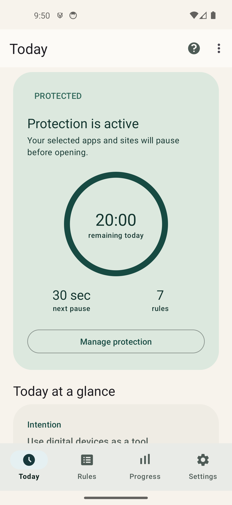
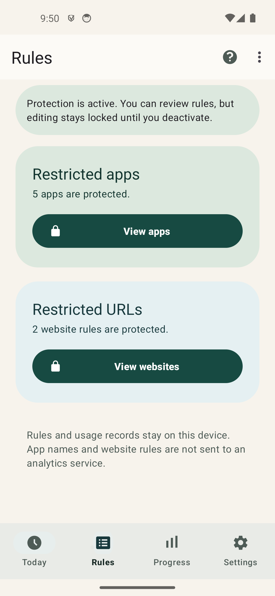
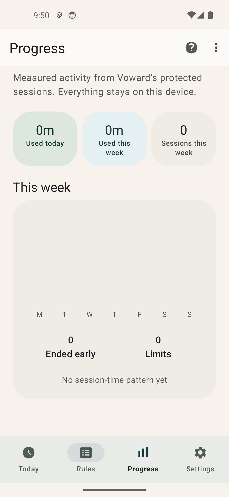
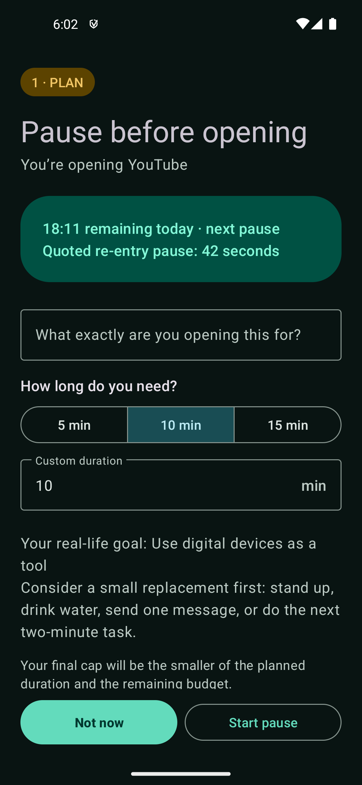

# Voward

Voward is a private Android self-management app that adds an intentional pause before selected apps and websites. It asks the user to state a purpose, choose a session length, wait, and then explicitly decide whether to continue.

Voward is not medical treatment, a diagnostic device, or a validated measure of addiction or any biological or psychological state. If digital use is causing significant distress, sleep loss, unsafe behavior, or loss of control, consider seeking help from a qualified mental-health professional.

## Screenshots

<p align="center">
  
  
  
  
</p>

<p align="center"><sub>Daily status &middot; Protected rules &middot; Local progress &middot; Intentional-use decision gate</sub></p>

## Current features

- Protect launchable apps selected from an installed-app picker.
- Protect website domains, paths, exact queries, or explicit `keyword:` rules in supported browsers.
- Require a purpose and a planned session of 1–60 minutes before regular protected content opens.
- Apply a configurable entry pause. Repeat entries increase the pause according to the configured growth percentage.
- Require a second **Open intentionally** choice after the pause; the app never opens protected content automatically when the timer reaches zero.
- Offer three configurable alternative next steps at the gate; selecting one returns to Android Home.
- Spend one allowance second for each second of approved protected use and end the session at the smaller of the planned duration or remaining allowance.
- Mark individual app or website rules as strict. Strict rules cannot be opened while protection is active.
- Show the remaining allowance, next pause, protected-rule count, sessions, sessions ended early, and limits reached.
- Keep up to 14 completed daily summaries on-device and show current-week protected-use time, sessions, outcomes, and common session start time.
- While protection is active, allow only additive rule changes: add new rules or make existing rules strict; removal and strict-to-regular changes stay locked.
- Import and export portable configuration as JSON.
- Optionally show allowance notifications, enable Device Admin uninstall friction, and use system grayscale during approved sessions.

## Requirements

- Android 8.0 (API 26) or newer.
- The **Attention Firewall** accessibility service is required for protection.
- Device Admin is optional and only adds uninstall friction.
- Notification permission is optional.
- Grayscale is optional and requires `WRITE_SECURE_SETTINGS`, which normal Android installs cannot grant from the app.

The app is intended for direct/private installation. Its accessibility and uninstall-protection behavior has not been prepared for Google Play accessibility-policy review.

## Setup

1. Open Voward and review the disclosure.
2. Set an intention, daily allowance, default session length, base entry pause, repeat-entry growth, and optional alternative next steps.
3. Add at least one protected app or website rule. Mark a rule strict only if it should remain unavailable while protection is active.
4. Enable the **Attention Firewall** accessibility service.
5. Optionally enable Device Admin uninstall protection and notifications.
6. Create a recovery key, select the deactivation cooldown, and choose how long you will have to confirm deactivation afterward.
7. Review the setup summary and activate protection.

Activation requires the accessibility service, at least one rule, a positive daily allowance, and a recovery key. While protection is active, rules may only be tightened: new rules can be added and existing rules can be made strict, but rules cannot be removed or changed from strict to regular. Timing and other protection settings remain locked. By default, deactivation requires entering the recovery key once to start a 24-hour cooldown, then entering it again during a silent 1-hour confirmation period and accepting a final confirmation. The cooldown and confirmation period can be configured while protection is inactive.

The recovery key is stored as a salted PBKDF2-HMAC-SHA256 hash and cannot be displayed or recovered. Protection remains fully active during a pending deactivation request. Eligibility uses Android monotonic time; a detected wall-clock change beyond two minutes or a reboot invalidates the request. The confirmation period begins and expires without a notification, badge, sound, background poll, or automatic action. With cooldown 0, the recovery key can deactivate protection immediately after explicit confirmation. Device Admin and accessibility add friction, but they do not turn a normal Android installation into kiosk mode.

### Deactivation policy

The cooldown can be set to **0**, **1 minute**, **6 hours**, **12 hours**, **24 hours**, **48 hours**, or **72 hours**. The time allowed to confirm deactivation afterward can be **1**, **2**, **3**, **6**, **12**, or **24 hours**. The defaults are 24 hours and a 1-hour confirmation period. Both values are selectable during initial setup and in Settings, and can be changed only while protection is inactive. A shorter confirmation period provides stronger protection against impulsive deactivation.

With a positive cooldown:

1. Open Settings, enter the correct recovery key, and explicitly request deactivation.
2. Protection, strict rules, and uninstall friction remain active during the cooldown. The request can be cancelled immediately without entering the key again.
3. After the cooldown, the confirmation period begins silently. Voward sends no notification or reminder and does not navigate to the deactivation screen.
4. During that period, enter the recovery key again, press **Deactivate protection**, and accept the final confirmation.

Incorrect key attempts do not restart or extend a request. Missing the confirmation period deletes the request and requires starting the complete process again. Changing the wall clock cannot accelerate eligibility; a detected shift beyond two minutes invalidates the request. Rebooting also invalidates it. Time-zone changes do not affect epoch progression and therefore do not invalidate a request.

When cooldown **0** is selected, no request or confirmation period is created. A correct recovery key, an explicit **Deactivate protection** press, and final confirmation deactivate protection immediately.

Optional uninstall protection combines Device Administrator uninstall friction with accessibility-based guarding of relevant app-info, uninstall, and service-detail screens while protection is active. It is a deterrent against impulsive removal, not kiosk mode or an absolute security guarantee.

## Allowance and sessions

All allowance values are stored in seconds:

```text
session_cost = elapsed approved seconds
session_limit = min(remaining allowance at entry, planned duration)
next_pause = clamp(base pause × (1 + growth × ln(1 + sessions today)), 1, 3600)
```

One allowance second always buys one second of approved protected use. The session limit shown at the gate stays fixed for that session. The remaining balance cannot fall below zero, and carried allowance is capped at one daily allowance.

Choosing **Not now** or leaving during the pause returns to the Android Home screen. Leaving protected content ends its active metering segment; reaching the quoted limit sends an app session Home or replaces the restricted browser tab. When no allowance remains, a new regular session cannot start. Strict rules ignore allowance and remain blocked until protection is deactivated.

## Progress

The Progress tab reports only activity measured by Voward: protected-use time, session count, sessions ended early, limits reached, and the most common session start hour for the current week. Completed daily summaries are retained locally for up to 14 days. Voward does not estimate “time saved” or infer urges, wellbeing, or health outcomes.

Resetting today’s statistics clears the current day’s counters without restoring allowance. The reset action and other timing/configuration controls are unavailable while protection is active.

## Website rules

- `example.com` matches the domain and its subdomains, but not `notexample.com`.
- `example.com/news` matches `/news` and its subtree, but not `/newspaper`.
- `example.com/search?q=focus` requires that exact query string.
- `keyword:shorts` performs an intentionally broad text match.

Ambiguous single-word and malformed rules are rejected. URL enforcement depends on the visible address field exposed by a supported browser. Browser or OEM updates can change accessibility behavior, so website blocking should be tested on each target device.

## Privacy and safety

- The accessibility service can observe foreground apps, window content, and supported browser address text. It can show the decision gate, navigate Home, replace a blocked browser tab, and—when optional uninstall protection is enabled—guard relevant app-info and uninstall screens.
- Rules, preferences, and usage counters remain on the device. Voward has no analytics SDK or external network client.
- The `INTERNET` manifest permission is used by a loopback-only server that serves the local browser block page.
- Configuration export writes only the selected JSON file. It includes the configured deactivation cooldown and confirmation-period durations, but excludes the recovery key, active-protection state, pending deactivation requests and timestamps, current allowance balance, usage counters, and temporary approvals.
- Purpose text entered at the gate is not stored.
- Android backup and data extraction are disabled.
- Voward prevents known emergency, dialer, Settings, System UI, permission-controller, and Voward packages from being selected as protected apps.

## Optional grayscale

On a development or privately managed device, grant grayscale access with ADB:

```shell
adb shell pm grant com.example.modernhabitrewire android.permission.WRITE_SECURE_SETTINGS
```

Voward reports whether this permission is available and restores the previous Android color-correction state when an approved session ends. The rest of the app works without this permission.

## Build and test

The project uses the checked-in Gradle wrapper, Java 17, compile/target SDK 36, application ID `com.example.modernhabitrewire`, and Java namespace `com.example.voward`.

On Windows:

```powershell
.\gradlew.bat testDebugUnitTest lintDebug assembleDebug
```

On macOS or Linux:

```shell
./gradlew testDebugUnitTest lintDebug assembleDebug
```

The local suite combines pure Java policy tests with Robolectric tests for preferences,
receivers, activities, adapters, and Android settings behavior. Generate the JaCoCo report with:

```powershell
.\gradlew.bat createDebugUnitTestCoverageReport
```

The HTML report is written to `app/build/reports/coverage/test/debug/index.html`.

Release signing is read from these environment variables:

- `MHR_RELEASE_STORE_FILE`
- `MHR_RELEASE_STORE_PASSWORD`
- `MHR_RELEASE_KEY_ALIAS`
- `MHR_RELEASE_KEY_PASSWORD`

Keep the signing material outside source control and preserve the application ID and signing key for upgrades. Accessibility interception, browser compatibility, Device Admin behavior, notifications, grayscale restoration, rotation, process death, and battery use also require testing on real target devices.
